  

  <a href="https://junjienian.com"><b>Website</b></a> ·
  <a href="https://junjienian.com/academic.html#publications"><b>Publications</b></a> ·
  <a href="https://scholar.google.com/citations?user=APPKW8YAAAAJ"><b>Google Scholar</b></a> ·
  <a href="https://junjienian.com/assets/cv.pdf"><b>CV</b></a> ·
  <a href="mailto:jjnian24@m.fudan.edu.cn"><b>Email</b></a>

I am an undergraduate AI researcher at **FudanNLP Alex Lab, Fudan University**, advised by [Prof. Yixin Cao](https://sites.google.com/view/yixin-homepage), and a 2026–2027 exchange student in Computer Science & Engineering at **UC San Diego**. I study how reasoning unfolds, where agent trajectories fail, and how internal signals can guide better decisions. Recent work includes [ARM](https://arxiv.org/abs/2601.07309) at **EMNLP 2026** and [Thinking Traps in Long Chain-of-Thought](https://aclanthology.org/2026.findings-acl.1930.pdf) in **Findings of ACL 2026**.

## Research in focus

<table>
  <tr>
    <td width="33%" valign="top">
      <h3><a href="https://github.com/JunjieNian/RISA">RISA</a></h3>
      
Routing-guided test-time scaling for software agents.

      
<a href="https://arxiv.org/abs/2608.22191">Paper</a> · <a href="https://junjienian.com/research/risa.html">Project</a> · <a href="https://github.com/JunjieNian/RISA">Code</a>

    </td>
    <td width="33%" valign="top">
      <h3><a href="https://github.com/JunjieNian/TraceGraph">TraceGraph</a></h3>
      
Shared decision landscapes for diagnosing agent trajectories.

      
<a href="https://arxiv.org/abs/2605.31308">Paper</a> · <a href="https://junjienian.com/research/tracegraph.html">Project</a> · <a href="https://github.com/JunjieNian/TraceGraph">Code</a>

    </td>
    <td width="33%" valign="top">
      <h3><a href="https://github.com/JunjieNian/SliceGraph">SliceGraph</a></h3>
      
Process isomers in multi-run chain-of-thought reasoning.

      
<a href="https://arxiv.org/abs/2605.14619">Paper</a> · <a href="https://junjienian.com/research/slicegraph.html">Project</a> · <a href="https://github.com/JunjieNian/SliceGraph">Code</a>

    </td>
  </tr>
</table>

## Contribution trail

<picture>
  <source media="(prefers-color-scheme: dark)" srcset="https://raw.githubusercontent.com/JunjieNian/JunjieNian/output/contribution-snake-dark.svg">
  <source media="(prefers-color-scheme: light)" srcset="https://raw.githubusercontent.com/JunjieNian/JunjieNian/output/contribution-snake.svg">
  
</picture>
